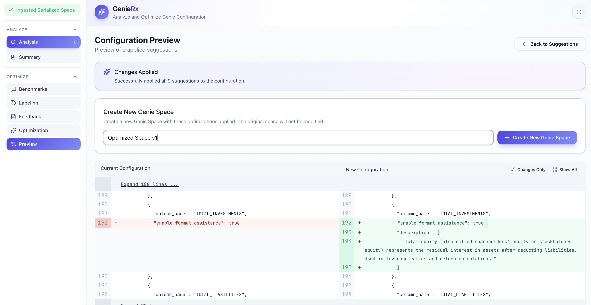

<!-- markdownlint-disable MD033 -->
# GenieRx: Analyze and Optimize Your Genie Space

> **Note:** This project is experimental and under active development.

An LLM-powered Databricks App tool that:

1. Analyzes your Databricks Genie Space configurations against best practices.
2. Get actionable insights and recommendations to improve your Genie Space setup by labeling Genie results on your pre-defined Benchmark questions.

## Walkthrough

### Analyze Mode

<p align="left">
  <br>
  <em>1) Enter your Genie Space ID or paste JSON, and then select mode (Analyze/Optimize)</em>
</p>

<p align="left">
  <br>
  <em>2) Preview the ingested configuration data</em>
</p>

<p align="left">
  <br>
  <em>3) Analyze each section against best practices</em>
</p>

<p align="left">
  <br>
  <em>4) View the final compliance summary and scores</em>
</p>

### Optimize Mode

<p align="left">
  <br>
  <em>1) Select benchmark questions</em>
</p>

<p align="left">
  <br>
  <em>2) Generating Genie responses</em>
</p>

<p align="left">
  <br>
  <em>3) Label Genie responses with feedback. All feedback are aggregated and used for optimization</em>
</p>

<p align="left">
  <br>
  <em>5) Review optimization suggestions</em>
</p>

<p align="left">
  <br>
  <em>6) Select suggestions and click "Create New Genie" to preview a side-by-side JSON diff of the proposed configuration changes</em>
</p>

## Prerequisites

- Access to Databricks Apps
- Access to a Databricks-hosted LLM endpoint (Claude Sonnet recommended)

## Quick Start

### 1. Import the Repository

1. Go to **Workspace > Repos > Add Repo**
2. Enter the Git URL: `https://github.com/hiydavid/dbx-genie-rx.git`
3. Click **Create Repo**

### 2. Configure the App

Open `app.yaml` in the workspace editor and configure the environment variables:

```yaml
env:
  # OPTIONAL: For capturing agent tracing
  - name: MLFLOW_EXPERIMENT_ID
    value: "" 
  # REQUIRED: Recommend sticking with Claude Sonnet 4.5 or Opus 4.5
  - name: LLM_MODEL
    value: "databricks-claude-sonnet-4-5" 
  # REQUIRED: For Optimize mode SQL execution
  - name: SQL_WAREHOUSE_ID
    value: ""  
  # REQUIRED: For creating new Genie Spaces (e.g., /Workspace/Users/you@company.com/)
  - name: GENIE_TARGET_DIRECTORY
    value: ""  
```

### 3. Deploy the App

1. Go to **Compute > Apps > Create App**
2. Name it (e.g., `genie-space-analyzer`)
3. Click **Deploy** and select your repo folder as the source
4. Click **Deploy** to start

> **Note:** The frontend is pre-built and included in the repo (`frontend/dist/`), so no build step is required.

### 4. Grant Permissions

After deploying, you must grant the app's service principal (SP) access to required resources:

1. **Find the SP**: Go to **Compute > Apps > [your app] > Authorization**
   - The SP name follows the pattern: `app-XXXXX [app-name]`

2. **Grant Genie Space access**: For each Genie Space you want to analyze:
   - Open the Genie Space settings
   - Add the SP with **Can Edit** permission

3. **Grant LLM endpoint access**:
   - Go to **Serving > [your LLM endpoint] > Permissions**
   - Add the SP with **Can Query** permission

4. **Grant SQL Warehouse access** (for Optimize mode):
   - Go to **SQL > SQL Warehouses > [your warehouse] > Permissions**
   - Add the SP with **Can Use** permission
   - Update `SQL_WAREHOUSE_ID` in `app.yaml` with your warehouse ID

5. **Grant table access** (for Optimize mode):
   - The SP needs SELECT access to the tables your Genie Space queries
   - Run the following SQL (replace with your SP name and table paths):

   ```sql
   -- Grant catalog and schema access
   GRANT USE CATALOG ON CATALOG your_catalog TO `app-XXXXX [your-app-name]`;
   GRANT USE SCHEMA ON SCHEMA your_catalog.your_schema TO `app-XXXXX [your-app-name]`;

   -- Grant SELECT on tables (option A: specific tables)
   GRANT SELECT ON TABLE your_catalog.your_schema.table1 TO `app-XXXXX [your-app-name]`;

   -- Or grant SELECT on entire schema (option B: all tables in schema)
   GRANT SELECT ON SCHEMA your_catalog.your_schema TO `app-XXXXX [your-app-name]`;
   ```

## MLflow Tracing (Optional)

MLflow tracing logs all LLM calls and analysis steps to your Databricks workspace. To enable it:

### Creating an MLflow Experiment

1. Navigate to **Machine Learning > Experiments**
2. Click **Create Experiment**
3. Name it (e.g., `genie-space-analyzer`)
4. Leave **Artifact Location** blank (uses default)
5. Click **Create**
6. Copy the experiment ID from the URL (e.g., `https://your-workspace.cloud.databricks.com/ml/experiments/123456789`) or from the experiment details
7. Update `MLFLOW_EXPERIMENT_ID` in `app.yaml` with this ID

### Viewing Traces

1. Go to your Databricks workspace
2. Navigate to **Machine Learning > Experiments**
3. Find your experiment
4. Click on **Traces** to see all analysis traces

**Filter by session:**

```text
metadata.`mlflow.trace.session` = '<session-id>'
```

## Local Development

For local development and customization, see [Local Development Guide](docs/local_development_guide.md).
