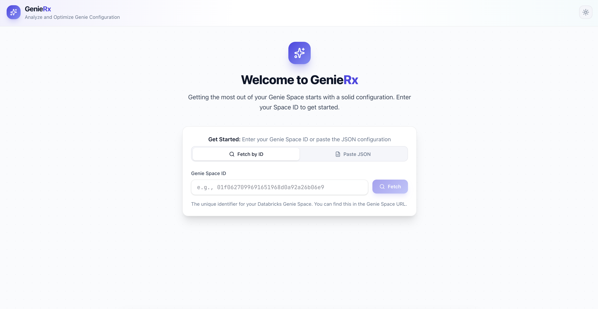
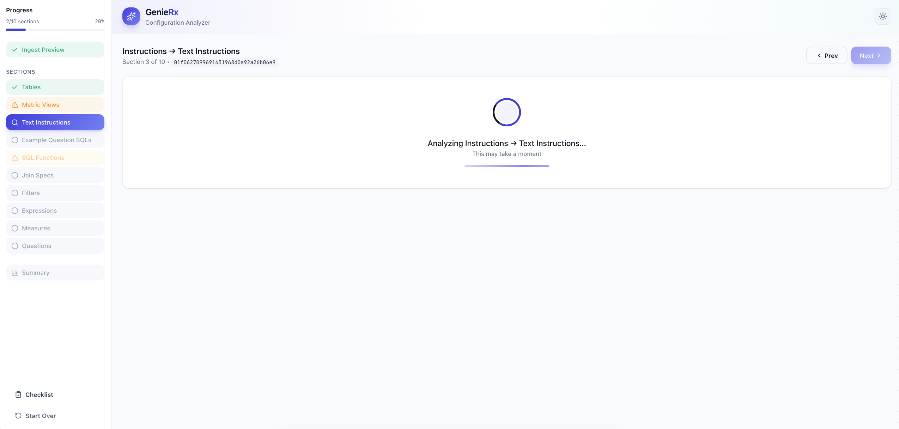
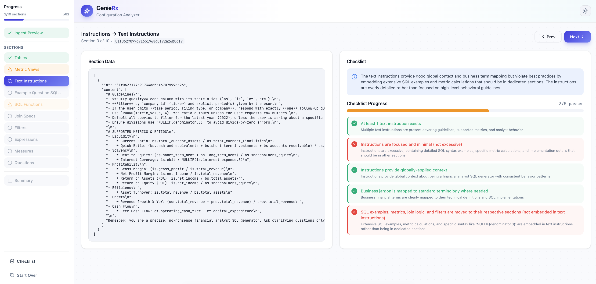
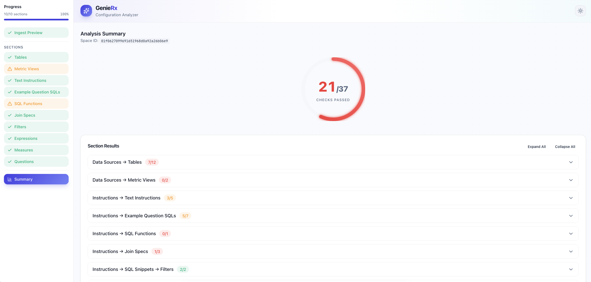
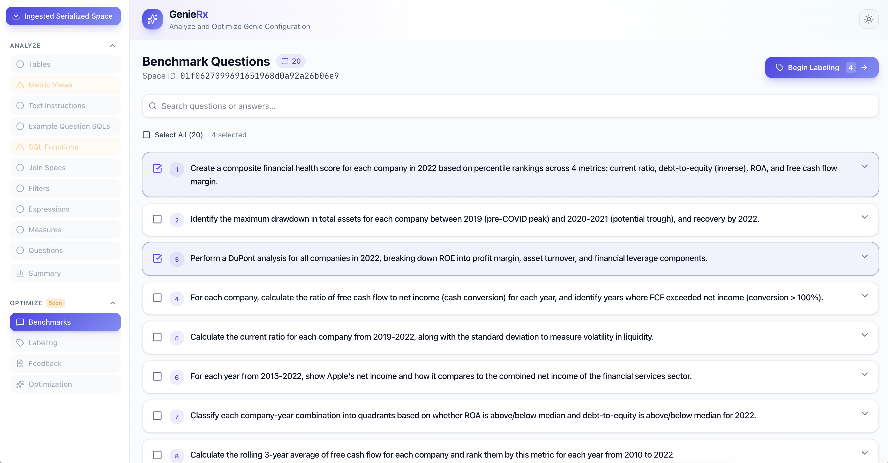
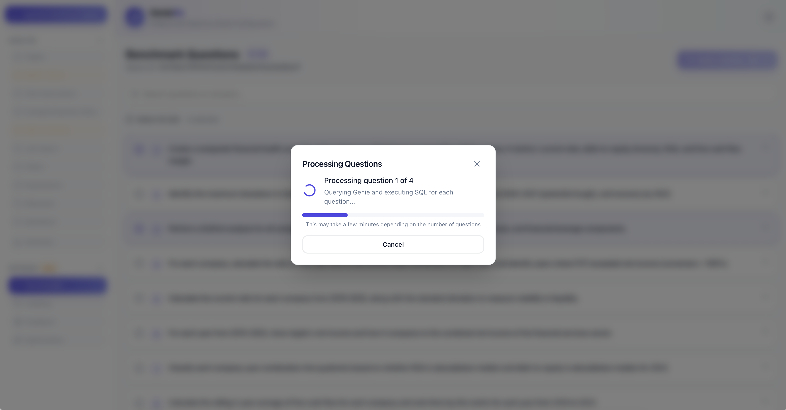
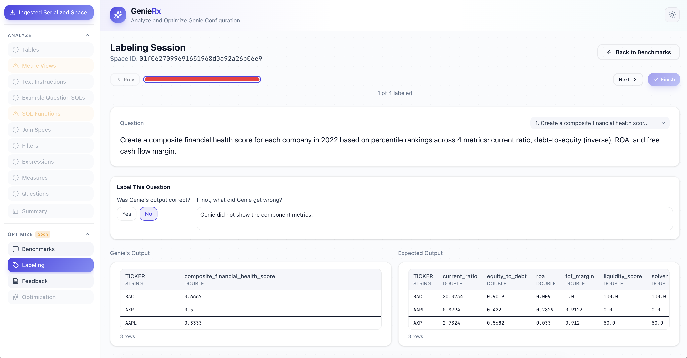
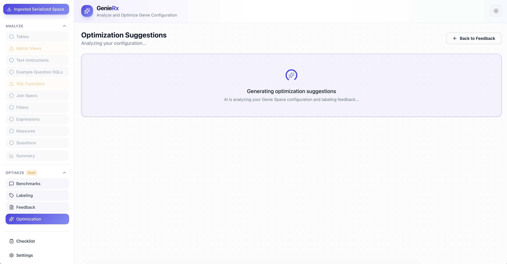
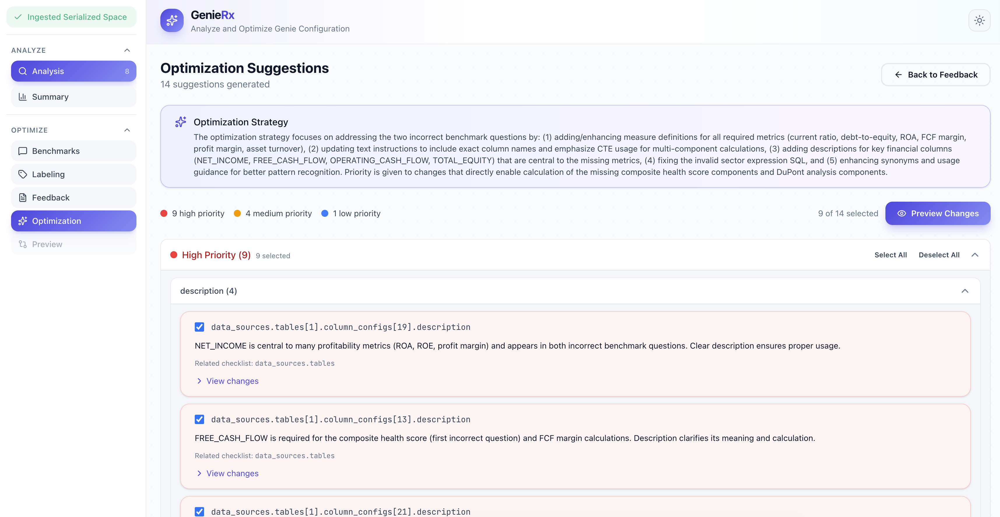

<!-- markdownlint-disable MD033 -->
# GenieRx: Analyze and Optimize Your Genie Space

> **Note:** This project is experimental and under active development.

An LLM-powered linting tool that analyzes Databricks Genie Space configurations against best practices. Get actionable insights and recommendations to improve your Genie Space setup.

This app was designed to be deployed on Databricks Apps. You can either:

- **Quick deploy**: Clone the repo directly into your Databricks workspace and deploy via Databricks Apps (see [Quick Start](#quick-start))
- **Local development**: Clone locally and use the shell scripts for development and deployment

## Walkthrough

### Analyze Mode

<p align="left">
  <br>
  <em>1) Enter your Genie Space ID or paste JSON, and then select mode (Analyze/Optimize)</em>
</p>

<p align="left">
  <br>
  <em>2) Preview the ingested configuration data</em>
</p>

<p align="left">
  <br>
  <em>3) Review sections pending analysis</em>
</p>

<p align="left">
  <br>
  <em>4) Analyze each section against best practices</em>
</p>

<p align="left">
  <br>
  <em>5) View the final compliance summary and scores</em>
</p>

### Optimize Mode

<p align="left">
  <br>
  <em>1) Select benchmark questions</em>
</p>

<p align="left">
  <br>
  <em>2) Generating Genie responses</em>
</p>

<p align="left">
  <br>
  <em>3) Label Genie responses with feedback</em>
</p>

<p align="left">
  <br>
  <em>4) Aggregating user labeling feedback</em>
</p>

<p align="left">
  <br>
  <em>5) Generating optimization suggestions</em>
</p>

<p align="left">
  <br>
  <em>6) Review optimization suggestions</em>
</p>

## Prerequisites

- Python 3.11+
- Node.js 18+ and npm
- [uv](https://docs.astral.sh/uv/getting-started/installation/) (Python package manager)
- [Databricks CLI](https://docs.databricks.com/dev-tools/cli/install) (v0.200+)
- Access to a Databricks workspace with Genie Spaces
- Access to a Databricks-hosted LLM endpoint (Claude Sonnet recommended)

## Quick Start

There are two main ways to deploy the app:

### Option 1: Deploy Directly in Databricks (Recommended)

If you want to use the app as-is, simply clone the repo into your Databricks workspace and deploy via Databricks Apps:

1. **Import the repo** into your workspace:
   - Go to **Workspace > Repos > Add Repo**
   - Enter the Git URL: `https://github.com/your-org/dbx-genie-rx.git`
   - Click **Create Repo**

2. **Configure the app**:
   - Open `app.yaml` in the workspace editor
   - Set `SQL_WAREHOUSE_ID` to enable Optimize mode (required for labeling)
   - Set `MLFLOW_EXPERIMENT_ID` to enable tracing (optional)
   - Change `LLM_MODEL` if you want to use a different Databricks-hosted model

3. **Deploy the app**:
   - Go to **Compute > Apps > Create App**
   - Name it (e.g., `genie-space-analyzer`)
   - Click **Deploy** and select your repo folder as the source
   - Click **Deploy** to start

4. **Grant permissions** to the app's service principal (see [Service Principal Permissions](#service-principal-permissions) for details)

> **Note:** The frontend is pre-built and included in the repo (`frontend/dist/`), so no build step is required.

### Option 2: Local Development with Shell Scripts

For local development or when you need to customize the app:

#### 1. Clone and Setup

```bash
# Clone the repository
git clone https://github.com/your-org/dbx-genie-rx.git
cd dbx-genie-rx

# Run the quickstart script
./scripts/quickstart.sh
```

The quickstart script will:

1. Check for required tools (uv, Databricks CLI)
2. Set up Databricks authentication (OAuth via CLI)
3. Create an MLflow experiment for tracing (optional)
4. Update `app.yaml` with your experiment ID
5. Create `.env.local` with your configuration
6. Install Python dependencies

#### 2. Build the Frontend

```bash
./scripts/build.sh
```

#### 3. Run Locally

```bash
uv run start-server
```

Open <http://localhost:8000> in your browser. The server serves both the API and the pre-built frontend.

**For frontend development with hot-reload**, run the backend and Vite dev server separately:

```bash
# Terminal 1 - Backend (with hot-reload on port 5001)
uv run uvicorn agent_server.start_server:app --reload --port 5001

# Terminal 2 - Frontend (hot-reload, proxies to backend on 5001)
cd frontend && npm run dev
```

Then open <http://localhost:5173> instead.

#### 4. Deploy to Databricks Apps

```bash
./scripts/deploy.sh genie-space-analyzer
```

Then complete deployment via the Databricks UI. After deployment, grant the app's service principal permissions as described in Option 1, Step 4.

## Configuration

There are two configuration files, each for a different environment:

| File | Purpose |
| ------ | --------- |
| `.env.local` | Local development (created by `quickstart.sh`) |
| `app.yaml` | Databricks Apps deployment |

### Local Development (`.env.local`)

The quickstart script creates `.env.local` for running the app locally:

```bash
# Databricks workspace URL
DATABRICKS_HOST=https://your-workspace.cloud.databricks.com

# Authentication (OAuth via Databricks CLI - recommended)
DATABRICKS_CONFIG_PROFILE=DEFAULT

# MLflow configuration - logs traces to Databricks
MLFLOW_TRACKING_URI=databricks
MLFLOW_REGISTRY_URI=databricks-uc
MLFLOW_EXPERIMENT_ID=123456789

# LLM model for analysis
LLM_MODEL=databricks-claude-sonnet-4-5

# SQL Warehouse for Optimize mode labeling
SQL_WAREHOUSE_ID=abc123def456
```

| Variable | Required | Description |
| ---------- | ---------- | ------------- |
| `DATABRICKS_HOST` | Yes | Your Databricks workspace URL |
| `DATABRICKS_CONFIG_PROFILE` | No | Databricks CLI profile (default: DEFAULT) |
| `DATABRICKS_TOKEN` | No | PAT token (alternative to OAuth) |
| `MLFLOW_EXPERIMENT_ID` | No | MLflow experiment ID - set to enable tracing |
| `LLM_MODEL` | Yes | LLM model name (default: `databricks-claude-sonnet-4-5`) |
| `SQL_WAREHOUSE_ID` | For Optimize | SQL Warehouse ID for executing benchmark queries in Optimize mode |

### Databricks Apps Deployment (`app.yaml`)

When deploying to Databricks Apps, configure environment variables in `app.yaml`:

```yaml
env:
  - name: MLFLOW_EXPERIMENT_ID
    value: "123456789"  # OPTIONAL: Set to enable tracing
  - name: LLM_MODEL
    value: "databricks-claude-sonnet-4"
  - name: SQL_WAREHOUSE_ID
    value: ""  # Required for Optimize mode SQL execution
```

| Variable | Required | Description |
| ---------- | ---------- | ------------- |
| `MLFLOW_EXPERIMENT_ID` | No | MLflow experiment ID - set to enable tracing |
| `LLM_MODEL` | Yes | LLM model name |
| `SQL_WAREHOUSE_ID` | For Optimize | SQL Warehouse ID for executing benchmark queries in Optimize mode |

> **Note:** In Databricks Apps, authentication is handled automatically via OAuth (OBO)—no need to configure `DATABRICKS_HOST` or tokens. The `MLFLOW_TRACKING_URI` and `MLFLOW_REGISTRY_URI` are pre-set to `databricks` and `databricks-uc`.

## Service Principal Permissions

After deploying, you must grant the app's service principal (SP) access to required resources:

1. **Find the SP**: Go to **Compute > Apps > [your app] > Authorization**
   - The SP name follows the pattern: `app-XXXXX [app-name]`

2. **Grant Genie Space access**: For each Genie Space you want to analyze:
   - Open the Genie Space settings
   - Add the SP with **Can Edit** permission

3. **Grant LLM endpoint access**:
   - Go to **Serving > [your LLM endpoint] > Permissions**
   - Add the SP with **Can Query** permission

4. **Grant SQL Warehouse access** (for Optimize mode):
   - Go to **SQL > SQL Warehouses > [your warehouse] > Permissions**
   - Add the SP with **Can Use** permission
   - Update `SQL_WAREHOUSE_ID` in `app.yaml` with your warehouse ID

5. **Grant table access** (for Optimize mode):
   - The SP needs SELECT access to the tables your Genie Space queries
   - Run the following SQL (replace with your SP name and table paths):

   ```sql
   -- Grant catalog and schema access
   GRANT USE CATALOG ON CATALOG your_catalog TO `app-XXXXX [your-app-name]`;
   GRANT USE SCHEMA ON SCHEMA your_catalog.your_schema TO `app-XXXXX [your-app-name]`;

   -- Grant SELECT on tables (option A: specific tables)
   GRANT SELECT ON TABLE your_catalog.your_schema.table1 TO `app-XXXXX [your-app-name]`;

   -- Or grant SELECT on entire schema (option B: all tables in schema)
   GRANT SELECT ON SCHEMA your_catalog.your_schema TO `app-XXXXX [your-app-name]`;
   ```

## Updating the Deployed App

After making code changes:

```bash
# Rebuild frontend and re-sync files
./scripts/build.sh
./scripts/deploy.sh genie-space-analyzer

# Then in Databricks UI: click Deploy on your app
```

## MLflow Tracing (Optional)

MLflow tracing is optional. To enable it, set `MLFLOW_EXPERIMENT_ID` in `app.yaml` to a valid experiment ID.

When enabled, all LLM calls and analysis steps are traced and logged to your Databricks workspace, grouped by session.

**View traces:**

1. Go to your Databricks workspace
2. Navigate to **Machine Learning > Experiments**
3. Find your experiment: `/Users/<your-email>/genie-space-analyzer`
4. Click on **Traces** to see all analysis traces

**Filter by session:**

```text
metadata.`mlflow.trace.session` = '<session-id>'
```
