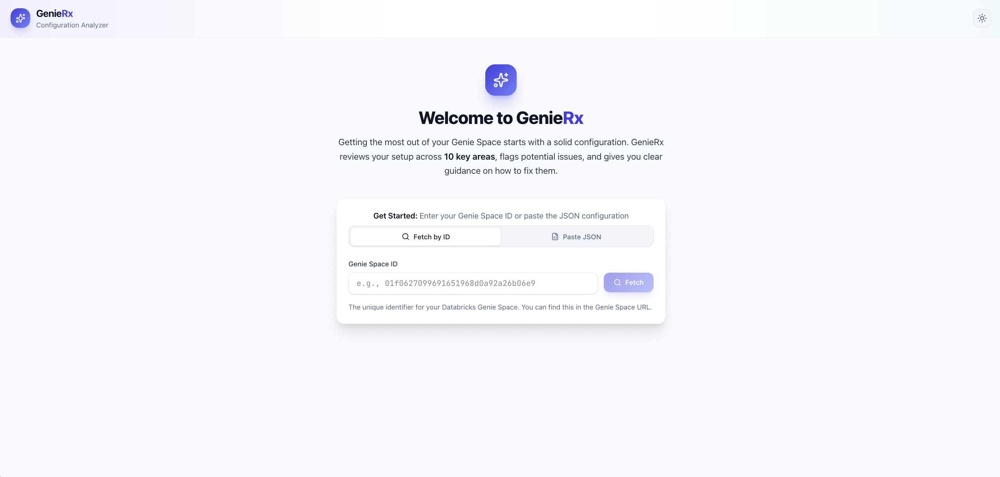
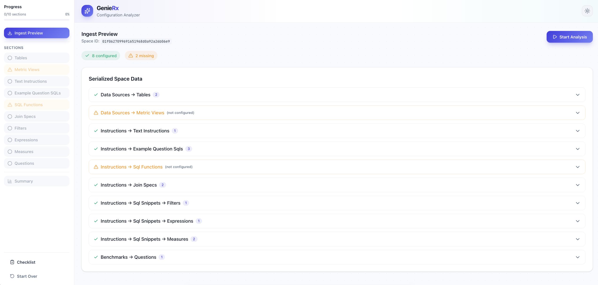

<!-- markdownlint-disable MD033 -->
# 🔍 GenieRx: The Genie Space Analyzer

> ⚠️ **Note:** This project is experimental and under active development.

An LLM-powered linting tool that analyzes Databricks Genie Space configurations against best practices. Get actionable insights and recommendations to improve your Genie Space setup.

This app was designed to be deployed on Databricks Apps. You can either:

- **Quick deploy**: Clone the repo directly into your Databricks workspace and deploy via Databricks Apps (see [Quick Start](#-quick-start))
- **Local development**: Clone locally and use the shell scripts for development and deployment


## ✨ Features

- **Comprehensive Analysis** — Evaluates 10 different sections of your Genie Space configuration
- **Customizable Checklist** — All checks defined in `docs/checklist-by-schema.md`; edit to add/remove checks without code changes
- **Best Practice Validation** — Checks against documented Databricks Genie Space best practices
- **Severity-based Findings** — Categorizes issues as high, medium, or low severity
- **Compliance Scoring** — Provides per-section and overall compliance scores (0-10)
- **Actionable Recommendations** — Each finding includes specific remediation guidance
- **Interactive Wizard UI** — Step-by-step analysis with progress navigation and JSON preview
- **Modern React Frontend** — Beautiful, responsive UI built with React, TypeScript, and Tailwind CSS v4
- **Dark Mode Support** — Auto-detects system preference with manual toggle, persists user choice
- **MLflow Tracing** — (Optional) Enable by setting `MLFLOW_EXPERIMENT_ID` in `app.yaml`
- **Configurable LLM** — Defaults to Claude Sonnet 4, configurable to any Databricks-hosted model
- **Databricks Apps Deployment** — Deploy with user-based (OBO) authentication

## 📸 Walkthrough

<p align="center">
  <br>
  <em>Enter your Genie Space ID or paste JSON</em>
</p>

<p align="center">
  <br>
  <em>Preview the ingested configuration data</em>
</p>

<p align="center">
  <br>
  <em>Review sections pending analysis</em>
</p>

<p align="center">
  <br>
  <em>Analyze each section against best practices</em>
</p>

<p align="center">
  <br>
  <em>View the final compliance summary and scores</em>
</p>

## 🏗️ Architecture

```text
┌─────────────────┐     ┌──────────────────────┐     ┌─────────────────┐
│   React Frontend│────▶│   FastAPI + Agent    │────▶│  Databricks LLM │
│    (frontend/)  │     │   (agent_server/)    │     │  (Claude Sonnet)│
└─────────────────┘     └──────────────────────┘     └─────────────────┘
                                  │
        ┌─────────────────────────┼─────────────────────────┐
        ▼                         ▼                         ▼
┌───────────────┐       ┌─────────────────┐       ┌─────────────────┐
│ Databricks API│       │    Checklist    │       │   MLflow Traces │
│ (Genie Space) │       │    (docs/*.md)  │       │   (Databricks)  │
└───────────────┘       └─────────────────┘       └─────────────────┘
```

### Analyzed Sections

The analyzer evaluates the following Genie Space configuration sections:

| Section | Description |
|---------|-------------|
| `data_sources.tables` | Table configurations and metadata |
| `data_sources.metric_views` | Metric view definitions |
| `instructions.text_instructions` | Natural language instructions |
| `instructions.example_question_sqls` | Example question-SQL pairs |
| `instructions.sql_functions` | Custom SQL function definitions |
| `instructions.join_specs` | Table join specifications |
| `instructions.sql_snippets.filters` | Reusable filter snippets |
| `instructions.sql_snippets.expressions` | Reusable expression snippets |
| `instructions.sql_snippets.measures` | Reusable measure snippets |
| `benchmarks.questions` | Benchmark question configurations |

## 📋 Prerequisites

- Python 3.11+
- Node.js 18+ and npm
- [uv](https://docs.astral.sh/uv/getting-started/installation/) (Python package manager)
- [Databricks CLI](https://docs.databricks.com/dev-tools/cli/install) (v0.200+)
- Access to a Databricks workspace with Genie Spaces
- Access to a Databricks-hosted LLM endpoint (Claude Sonnet recommended)

## 🚀 Quick Start

There are two main ways to deploy the app:

### Option 1: Deploy Directly in Databricks (Recommended)

If you want to use the app as-is, simply clone the repo into your Databricks workspace and deploy via Databricks Apps:

1. **Import the repo** into your workspace:
   - Go to **Workspace > Repos > Add Repo**
   - Enter the Git URL: `https://github.com/your-org/dbx-genie-rx.git`
   - Click **Create Repo**

2. **Configure the app** (optional):
   - Open `app.yaml` in the workspace editor
   - Set `MLFLOW_EXPERIMENT_ID` to enable tracing (optional)
   - Change `LLM_MODEL` if you want to use a different Databricks-hosted model

3. **Deploy the app**:
   - Go to **Compute > Apps > Create App**
   - Name it (e.g., `genie-space-analyzer`)
   - Click **Deploy** and select your repo folder as the source
   - Click **Deploy** to start

4. **Grant permissions** to the app's service principal:
   - Go to **Compute > Apps > [your app] > Authorization** to find the SP name
   - Add the SP to each Genie Space you want to analyze with **Can Edit** permission
   - Add the SP to the LLM serving endpoint with **Can Query** permission

> **Note:** The frontend is pre-built and included in the repo (`frontend/dist/`), so no build step is required.

### Option 2: Local Development with Shell Scripts

For local development or when you need to customize the app:

#### 1. Clone and Setup

```bash
# Clone the repository
git clone https://github.com/your-org/dbx-genie-rx.git
cd dbx-genie-rx

# Run the quickstart script
./scripts/quickstart.sh
```

The quickstart script will:

1. ✅ Check for required tools (uv, Databricks CLI)
2. ✅ Set up Databricks authentication (OAuth via CLI)
3. ✅ Create an MLflow experiment for tracing (optional)
4. ✅ Update `app.yaml` with your experiment ID
5. ✅ Create `.env.local` with your configuration
6. ✅ Install Python dependencies

#### 2. Build the Frontend

```bash
./scripts/build.sh
```

#### 3. Run Locally

```bash
uv run start-server
```

Open <http://localhost:8000> in your browser. The server serves both the API and the pre-built frontend.

**For frontend development with hot-reload**, run the backend and Vite dev server separately:

```bash
# Terminal 1 - Backend
uv run start-server

# Terminal 2 - Frontend (hot-reload)
cd frontend && npm run dev
```

Then open <http://localhost:5173> instead.

#### 4. Deploy to Databricks Apps

```bash
./scripts/deploy.sh genie-space-analyzer
```

Then complete deployment via the Databricks UI. After deployment, grant the app's service principal permissions as described in Option 1, Step 4.

## ⚙️ Configuration

### Environment Variables

The quickstart script creates `.env.local` with your configuration:

```bash
# Databricks workspace URL
DATABRICKS_HOST=https://your-workspace.cloud.databricks.com

# Authentication (OAuth via Databricks CLI - recommended)
DATABRICKS_CONFIG_PROFILE=DEFAULT

# MLflow configuration - logs traces to Databricks
MLFLOW_TRACKING_URI=databricks
MLFLOW_REGISTRY_URI=databricks-uc
MLFLOW_EXPERIMENT_ID=123456789

# LLM model for analysis
LLM_MODEL=databricks-claude-sonnet-4
```

| Variable | Required | Description |
|----------|----------|-------------|
| `DATABRICKS_HOST` | Yes (local) | Your Databricks workspace URL |
| `DATABRICKS_CONFIG_PROFILE` | No | Databricks CLI profile (default: DEFAULT) |
| `DATABRICKS_TOKEN` | Optional | PAT token (alternative to OAuth) |
| `MLFLOW_TRACKING_URI` | No | Set to `databricks` to log traces to workspace |
| `MLFLOW_EXPERIMENT_ID` | No | MLflow experiment ID - set to enable tracing |
| `LLM_MODEL` | Yes | LLM model name (default: `databricks-claude-sonnet-4`) |

> **Note:** When deployed to Databricks Apps, configure these in `app.yaml`. MLflow tracing is optional—leave `MLFLOW_EXPERIMENT_ID` empty to disable it. Authentication is handled automatically via OAuth (OBO).

## 📖 Usage

### React UI

The interactive wizard guides you through 4 phases:

1. **Input** — Enter your Genie Space ID or paste JSON, then click "Fetch" or "Load JSON"
2. **Ingest Preview** — Review the serialized JSON data and metrics before analysis
3. **Section Analysis** — Step through each section, view checklist progress and findings
4. **Summary** — See overall compliance score with expandable section results

**UI Features:**

- 📍 **Sidebar Navigation** — Track progress and jump to completed sections
- 📄 **JSON Preview** — Inspect raw data alongside analysis results
- ✅ **Checklist Progress** — Visual pass/fail indicators for each check
- 📊 **Score Cards** — Color-coded compliance scores
- 📚 **Checklist Reference** — Built-in documentation

### REST API

The backend exposes the following API endpoints:

| Endpoint | Method | Description |
|----------|--------|-------------|
| `/api/space/fetch` | POST | Fetch a Genie Space by ID |
| `/api/space/parse` | POST | Parse pasted Genie Space JSON |
| `/api/analyze/section` | POST | Analyze a single section |
| `/api/analyze/stream` | POST | Stream analysis progress (SSE) |
| `/api/checklist` | GET | Get checklist documentation |
| `/api/sections` | GET | List all section names |
| `/invocations` | POST | Legacy MLflow agent endpoint |

Example API call:

```bash
curl -X POST http://localhost:5001/api/space/fetch \
  -H "Content-Type: application/json" \
  -d '{"genie_space_id": "your-genie-space-id"}'
```

## 📁 Project Structure

```text
dbx-genie-rx/
├── agent_server/           # Core analyzer backend
│   ├── agent.py           # GenieSpaceAnalyzer class & MLflow tracing
│   ├── api.py             # REST API endpoints for React frontend
│   ├── auth.py            # Authentication (PAT local, OBO for Apps)
│   ├── checklist_parser.py # Parses checklist from docs/checklist-by-schema.md
│   ├── checks.py          # Wrapper for checklist item retrieval
│   ├── ingest.py          # Databricks SDK client for Genie Spaces
│   ├── models.py          # Pydantic models (AgentInput, AgentOutput)
│   ├── prompts.py         # LLM prompt templates
│   └── start_server.py    # FastAPI server entry point
├── frontend/               # React frontend application
│   ├── public/fonts/      # Self-hosted font files (woff2)
│   ├── src/
│   │   ├── components/    # React components
│   │   │   ├── ui/       # Reusable UI components (Button, Card, etc.)
│   │   │   ├── InputPhase.tsx
│   │   │   ├── IngestPhase.tsx
│   │   │   ├── AnalysisPhase.tsx
│   │   │   ├── SummaryPhase.tsx
│   │   │   ├── SidebarNav.tsx
│   │   │   ├── ThemeToggle.tsx    # Dark/light mode toggle
│   │   │   └── ScoreGauge.tsx     # Animated radial score gauge
│   │   ├── hooks/        # Custom React hooks (useTheme, etc.)
│   │   ├── lib/          # Utilities and API client
│   │   └── types/        # TypeScript type definitions
│   ├── package.json
│   └── vite.config.ts
├── scripts/
│   ├── quickstart.sh      # Local development setup
│   ├── build.sh           # Build frontend and backend
│   └── deploy.sh          # Databricks Apps deployment
├── docs/                   # Checklist and schema documentation
│   ├── checklist-by-schema.md  # Source of truth for all checks (editable)
│   └── genie-space-schema.md   # Genie Space JSON schema reference
├── output/                 # Output files (saved analysis reports)
├── app.py                  # Legacy Streamlit UI (deprecated)
├── app.yaml                # Databricks Apps configuration
├── requirements.txt        # Python dependencies (for Databricks Apps)
└── pyproject.toml          # Project configuration
```

## 🚀 Deploying to Databricks Apps

See the [Quick Start](#-quick-start) section for step-by-step deployment instructions.

### Service Principal Permissions

After deploying, you must grant the app's service principal (SP) access to required resources:

1. **Find the SP**: Go to **Compute > Apps > [your app] > Authorization**
   - The SP name follows the pattern: `app-XXXXX [app-name]`

2. **Grant Genie Space access**: For each Genie Space you want to analyze:
   - Open the Genie Space settings
   - Add the SP with **Can Edit** permission

3. **Grant LLM endpoint access**:
   - Go to **Serving > [your LLM endpoint] > Permissions**
   - Add the SP with **Can Query** permission

### Authentication

| Environment | Auth Method | Description |
|-------------|-------------|-------------|
| Local Development | PAT / OAuth | Uses `DATABRICKS_TOKEN` or CLI OAuth |
| Databricks Apps | SP + OBO | SP accesses resources; OBO for user context |

### Troubleshooting

If you get "Unable to get space" errors:

- **Verify SP permissions**: Ensure the app's SP has **Can Edit** on the Genie Space
- **Use the "Paste JSON" option** as a workaround—manually fetch the space JSON and paste it into the app

### Updating the Deployed App

After making code changes:

```bash
# Rebuild frontend and re-sync files
./scripts/build.sh
./scripts/deploy.sh genie-space-analyzer

# Then in Databricks UI: click Deploy on your app
```

## 📊 MLflow Tracing (Optional)

MLflow tracing is optional. To enable it, set `MLFLOW_EXPERIMENT_ID` in `app.yaml` to a valid experiment ID.

When enabled, all LLM calls and analysis steps are traced and logged to your Databricks workspace, grouped by session.

**View traces:**

1. Go to your Databricks workspace
2. Navigate to **Machine Learning > Experiments**
3. Find your experiment: `/Users/<your-email>/genie-space-analyzer`
4. Click on **Traces** to see all analysis traces

**Filter by session:**

```text
metadata.`mlflow.trace.session` = '<session-id>'
```

## 🛠️ Development

### Frontend Development

```bash
cd frontend

# Install dependencies
npm install

# Start development server (with hot reload)
npm run dev

# Build for production
npm run build

# Type checking
npm run build  # TypeScript is checked during build
```

### Font Setup (Optional)

The frontend uses self-hosted fonts for the design system. Download and place the following `.woff2` files in `frontend/public/fonts/`:

| Font | Files | Source |
|------|-------|--------|
| Cabinet Grotesk | `CabinetGrotesk-Bold.woff2`, `CabinetGrotesk-Extrabold.woff2` | [fontshare.com](https://www.fontshare.com/fonts/cabinet-grotesk) |
| General Sans | `GeneralSans-Regular.woff2`, `GeneralSans-Medium.woff2`, `GeneralSans-Semibold.woff2` | [fontshare.com](https://www.fontshare.com/fonts/general-sans) |
| JetBrains Mono | `JetBrainsMono-Regular.woff2`, `JetBrainsMono-Medium.woff2` | [jetbrains.com](https://www.jetbrains.com/lp/mono/) |

> **Note:** The app works without these fonts (falls back to system fonts), but the custom fonts provide the intended design experience.

### Backend Development

```bash
# Install dependencies
uv sync

# Start server with hot reload
uv run uvicorn agent_server.start_server:app --reload --port 5001

# Run tests
uv run python test_agent.py
```

## 🛣️ Future Roadmap

- 💾 **Save Summary Report** — Export analysis results to JSON/Markdown files
- 📈 **Historical Comparison** — Track improvements over time
- 🔧 **Auto-fix Suggestions** — Generate fix scripts for common issues
