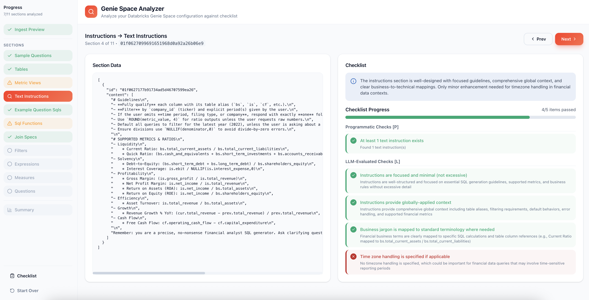

# 🔍 GenieRX: The Genie Space Analyzer

> ⚠️ **Note:** This project is experimental and under active development.

An LLM-powered linting tool that analyzes Databricks Genie Space configurations against best practices. Get actionable insights and recommendations to improve your Genie Space setup. 

Simply clone the repo in your local development environment, run `quickstart.sh` to setup authentication and MLflow experiment to start testing locally. This app was designed to be deployed on Databricks Apps, so to deploy, simply run `deploy.sh` and then follow the instruction to create and deploy a Databricks App.


## ✨ Features

<p align="center">
  
</p>

- **Comprehensive Analysis** — Evaluates 11 different sections of your Genie Space configuration
- **Best Practice Validation** — Checks against documented Databricks Genie Space best practices
- **Severity-based Findings** — Categorizes issues as high, medium, or low severity
- **Compliance Scoring** — Provides per-section and overall compliance scores (0-10)
- **Actionable Recommendations** — Each finding includes specific remediation guidance
- **Interactive Wizard UI** — Step-by-step analysis with progress navigation and JSON preview
- **Multiple Interfaces** — Use via REST API or interactive Streamlit UI
- **MLflow Tracing** — Full observability with session-grouped traces logged to Databricks
- **Databricks Apps Deployment** — Deploy with user-based (OBO) authentication

## 🏗️ Architecture

```
┌─────────────────┐     ┌──────────────────────┐     ┌─────────────────┐
│   Streamlit UI  │────▶│   GenieSpaceAnalyzer │────▶│  Databricks LLM │
│    (app.py)     │     │   (agent_server/)    │     │  (Claude Sonnet)│
└─────────────────┘     └──────────────────────┘     └─────────────────┘
                                  │
        ┌─────────────────────────┼─────────────────────────┐
        ▼                         ▼                         ▼
┌───────────────┐       ┌─────────────────┐       ┌─────────────────┐
│ Databricks API│       │  Best Practices │       │   MLflow Traces │
│ (Genie Space) │       │    (docs/*.md)  │       │   (Databricks)  │
└───────────────┘       └─────────────────┘       └─────────────────┘
```

### Analyzed Sections

The analyzer evaluates the following Genie Space configuration sections:

| Section | Description |
|---------|-------------|
| `config.sample_questions` | Sample questions shown to users |
| `data_sources.tables` | Table configurations and metadata |
| `data_sources.metric_views` | Metric view definitions |
| `instructions.text_instructions` | Natural language instructions |
| `instructions.example_question_sqls` | Example question-SQL pairs |
| `instructions.sql_functions` | Custom SQL function definitions |
| `instructions.join_specs` | Table join specifications |
| `instructions.sql_snippets.filters` | Reusable filter snippets |
| `instructions.sql_snippets.expressions` | Reusable expression snippets |
| `instructions.sql_snippets.measures` | Reusable measure snippets |
| `benchmarks.questions` | Benchmark question configurations |

## 📋 Prerequisites

- Python 3.13+
- [uv](https://docs.astral.sh/uv/getting-started/installation/) (Python package manager)
- [Databricks CLI](https://docs.databricks.com/dev-tools/cli/install) (v0.200+)
- Access to a Databricks workspace with Genie Spaces
- Access to a Databricks-hosted LLM endpoint (Claude Sonnet recommended)

## 🚀 Quick Start

### 1. Clone and Setup

```bash
# Clone the repository
git clone https://github.com/your-org/dbx-genie-rx.git
cd dbx-genie-rx

# Run the quickstart script
./scripts/quickstart.sh
```

The quickstart script will:
1. ✅ Check for required tools (uv, Databricks CLI)
2. ✅ Set up Databricks authentication (OAuth via CLI)
3. ✅ Create an MLflow experiment for tracing
4. ✅ Update `app.yaml` with your experiment ID
5. ✅ Create `.env.local` with your configuration
6. ✅ Install Python dependencies

### 2. Run Locally

```bash
# Run the Streamlit UI
uv run streamlit run app.py
```

Open http://localhost:8501 in your browser.

### 3. Deploy to Databricks Apps

```bash
# Sync and deploy
./scripts/deploy.sh genie-space-analyzer
```

Then deploy via the Databricks UI (see [Deploying to Databricks Apps](#-deploying-to-databricks-apps)).

## ⚙️ Configuration

### Environment Variables

The quickstart script creates `.env.local` with your configuration:

```bash
# Databricks workspace URL
DATABRICKS_HOST=https://your-workspace.cloud.databricks.com

# Authentication (OAuth via Databricks CLI - recommended)
DATABRICKS_CONFIG_PROFILE=DEFAULT

# MLflow configuration - logs traces to Databricks
MLFLOW_TRACKING_URI=databricks
MLFLOW_REGISTRY_URI=databricks-uc
MLFLOW_EXPERIMENT_ID=123456789

# LLM model for analysis
LLM_MODEL=databricks-claude-sonnet-4
```

| Variable | Required | Description |
|----------|----------|-------------|
| `DATABRICKS_HOST` | Yes (local) | Your Databricks workspace URL |
| `DATABRICKS_CONFIG_PROFILE` | No | Databricks CLI profile (default: DEFAULT) |
| `DATABRICKS_TOKEN` | Optional | PAT token (alternative to OAuth) |
| `MLFLOW_TRACKING_URI` | Yes | Set to `databricks` to log traces to workspace |
| `MLFLOW_EXPERIMENT_ID` | Yes | MLflow experiment ID for tracing |
| `LLM_MODEL` | No | LLM model name (default: `databricks-claude-sonnet-4`) |

> **Note:** When deployed to Databricks Apps, authentication is handled automatically via OAuth (OBO). Environment variables are configured in `app.yaml`.

## 📖 Usage

### Streamlit UI

The interactive wizard guides you through 4 phases:

1. **Input** — Enter your Genie Space ID and click "Fetch Space"
2. **Ingest Preview** — Review the serialized JSON data before analysis
3. **Section Analysis** — Step through each section, view findings by severity
4. **Summary** — See overall compliance score and all findings

**UI Features:**
- 📍 **Sidebar Navigation** — Track progress and jump to completed sections
- 📄 **JSON Preview** — Inspect raw data alongside analysis results
- 🎯 **Severity Grouping** — Findings organized by High / Medium / Low
- 📚 **Best Practices** — Built-in reference documentation

### REST API

Start the MLflow Agent Server:

```bash
# Start server
uv run start-server

# With hot-reload for development
uv run start-server --reload
```

Send analysis requests to http://localhost:8000:

```bash
curl -X POST http://localhost:8000/invocations \
  -H "Content-Type: application/json" \
  -d '{"genie_space_id": "your-genie-space-id"}'
```

## 📁 Project Structure

```
dbx-genie-rx/
├── agent_server/           # Core analyzer backend
│   ├── agent.py           # GenieSpaceAnalyzer class & MLflow tracing
│   ├── auth.py            # Authentication (PAT local, OBO for Apps)
│   ├── ingest.py          # Databricks SDK client for Genie Spaces
│   ├── models.py          # Pydantic models (AgentInput, AgentOutput)
│   ├── prompts.py         # LLM prompt templates
│   └── start_server.py    # MLflow AgentServer entry point
├── scripts/
│   ├── quickstart.sh      # Local development setup
│   └── deploy.sh          # Databricks Apps deployment
├── docs/                   # Best practices documentation
│   ├── best-practices-by-schema.md
│   └── genie-space-schema.md
├── output/                 # Output files (future: saved reports)
├── app.py                  # Streamlit UI application
├── app.yaml                # Databricks Apps configuration
├── requirements.txt        # Python dependencies (for Databricks Apps)
├── pyproject.toml          # Project configuration (for local dev)
└── test_agent.py           # Test script
```

## 🚀 Deploying to Databricks Apps

Deploy the Genie Space Analyzer to Databricks Apps for production use. The app uses **user-based (OBO) authentication**, meaning users can only analyze Genie Spaces they have permission to access.

### Prerequisites

Before deploying, ensure you've run the quickstart script:

```bash
./scripts/quickstart.sh
```

This creates the MLflow experiment and configures `app.yaml` with the experiment ID.

### Deploy

```bash
./scripts/deploy.sh genie-space-analyzer
```

The deploy script will:
1. ✅ Verify Databricks CLI and authentication
2. ✅ Check/prompt for MLflow experiment ID in `app.yaml`
3. ✅ Sync files to your workspace
4. ✅ Provide UI deployment instructions

Then complete deployment via the Databricks UI:

1. Go to **Compute > Apps** in your workspace
2. Click **Create App** (if first time) and name it `genie-space-analyzer`
3. Click **Deploy** and select the synced folder:
   ```
   /Workspace/Users/<your-email>/apps/genie-space-analyzer
   ```
4. Click **Deploy** to start

### Authentication

| Environment | Auth Method | Description |
|-------------|-------------|-------------|
| Local Development | PAT / OAuth | Uses `DATABRICKS_TOKEN` or CLI OAuth |
| Databricks Apps | OBO (User) | Uses the logged-in user's OAuth token |

**OBO (On-behalf-of) Authentication:**
- Users must authenticate with Databricks to use the app
- Users can only analyze Genie Spaces they have **Manage** permission on
- If a user lacks access, they'll see an appropriate error

### Updating the Deployed App

After making code changes:

```bash
# Re-sync files
./scripts/deploy.sh genie-space-analyzer

# Then in Databricks UI: click Deploy on your app
```

## 📊 MLflow Tracing

All LLM calls and analysis steps are traced with MLflow. Traces are logged to your Databricks workspace and grouped by session.

**View traces:**
1. Go to your Databricks workspace
2. Navigate to **Machine Learning > Experiments**
3. Find your experiment: `/Users/<your-email>/genie-space-analyzer`
4. Click on **Traces** to see all analysis traces

**Filter by session:**
```
metadata.`mlflow.trace.session` = '<session-id>'
```

## 🛣️ Future Roadmap

- 💾 **Save Summary Report** — Export analysis results to JSON/Markdown files

## 📜 License

MIT License — see [LICENSE](LICENSE) for details.
